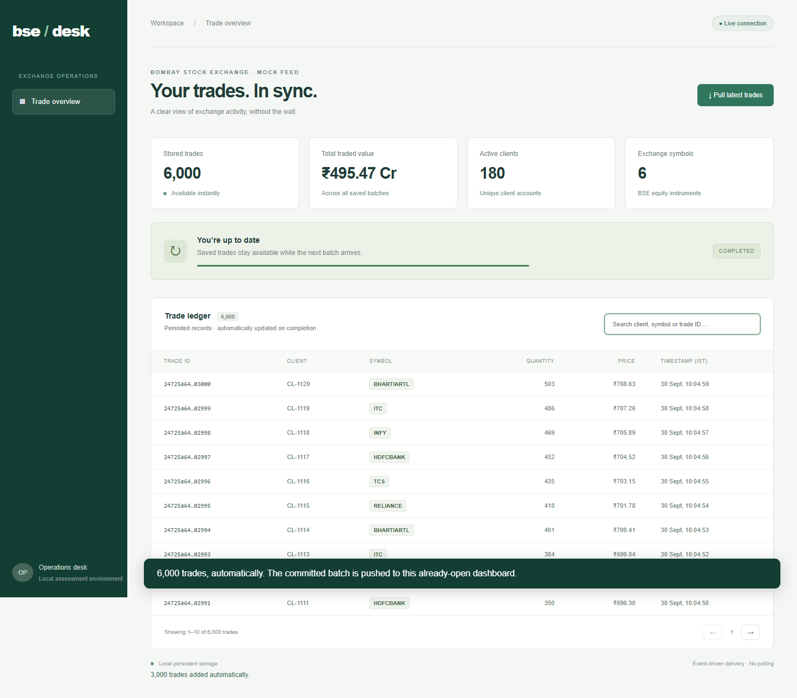

# BSE Trade Desk

The [GitHub Pages site](https://nidhichaudhari2020-hue.github.io/bsetradedashboard/) is an interface-only preview. GitHub Pages cannot run this application's Node.js API, SQLite storage, or WebSocket ingestion. Use the setup instructions below for the complete working application. A full public deployment requires a Node-compatible host with persistent storage and WebSocket support.

### Software Engineer Technical Assessment

A persistent trade dashboard that stays responsive during long-running exchange pulls and receives completed batches automatically, without page refreshes, data polling, or scheduled jobs.

**Stack:** Node.js · SQLite · WebSocket · JavaScript · HTML/CSS



## Quick start

Requires **Node.js 22.14+** and npm. From the repository root:

```sh
npm ci
npm run demo
```

Open **http://localhost:4300** and click **Pull latest trades**. Demo mode takes approximately 12 seconds. On a fresh database, the dashboard starts with 3,000 saved seed records; completion automatically adds another 3,000.

For the assessment's **15-minute pull**, stop demo mode and run `npm start`. SQLite is bundled with Node; Node 22 may print an experimental-feature warning. No API keys, database service, or font CDN are required.

## Requirement coverage

| Requirement | Implementation |
| --- | --- |
| Mock GET /getTrades | Deterministic cursor-paginated feed; 3,000 records per batch |
| Trade fields | ID, client, symbol, quantity, INR price and ISO timestamp |
| Configurable 15-minute pull | 60 sequential pages; 15 seconds per page by default |
| 30-second HTTP limit | Short page requests, 25-second fetch deadline, 30-second response cutoff |
| Immediate dashboard access | Saved SQLite records read independently of ingestion |
| Automatic updates | WebSocket snapshot after the database transaction commits |
| No polling or scheduler | User-triggered asynchronous task and server-pushed events |
| Supporting deliverables | Architecture note, reviewer guide and captioned walkthrough |

## Timeout design decision

Moving a 15-minute HTTP request into a background task does not remove the network's 30-second connection limit. This solution makes two assumptions explicit:

1. The **mock exchange supports cursor pagination**, keeping individual HTTP responses within budget.
2. The network permits **upgraded WebSocket connections** for push delivery.

These are proposed interface and infrastructure requirements, not claims about the real BSE API. A monolithic 15-minute exchange response requires a different exchange interface or network topology. See the [architecture diagram and rationale](docs/architecture.md) and [explicit assessment assumptions](docs/assumptions.md).

## Configuration

| Setting | Default | Description |
| --- | --- | --- |
| PORT | 4300 | Local HTTP and WebSocket port |
| PULL_DELAY_MS | 900000 | Aggregate simulated delay, from 0 to 1,200,000 ms |
| --demo | Off | Uses 12,000 ms unless overridden by PULL_DELAY_MS |
| Database | data/trades.sqlite | Created automatically; retained across restarts |

PowerShell:

```powershell
$env:PULL_DELAY_MS = '900000'
npm start
```

POSIX shell:

```sh
PULL_DELAY_MS=900000 npm start
```

Total runtime includes processing and network overhead. Each new pull uses a distinct mock batch ID to simulate new records; this does not model a real exchange watermark. The initial seed batch is demonstration data.

## API reference

| Interface | Result |
| --- | --- |
| GET /getTrades?cursor=0&batch=exchange | 50 trades, nextCursor and total; continue until cursor is null |
| GET /api/trades | Persisted records, latest job state and configured delay |
| POST /api/pulls | 202 Accepted with job ID; 409 Conflict if a pull is active |
| WS /events | Initial snapshot, progress events and committed completion snapshot |

Repeated requests for the same exchange batch and cursor return identical records. Trade IDs are primary keys. Partial batches are not published. Failed jobs leave saved trades available and can be retried manually.

## Validation

```sh
npm test
```

Integration tests cover immediate cache reads, asynchronous acceptance, concurrent-pull rejection, atomic publication, completion push, reconnection snapshots, persistence, interrupted jobs and invalid configuration.

Browser verification covers searching during ingestion, automatic growth from 3,000 to 6,000 records, a single initial data request, no JavaScript errors, empty search results and mobile layout. The video uses accelerated timing. **Full-duration verification passed on 1 October 2026:** 15 minutes 1.635 seconds total, 25 ms acceptance, 27 ms saved-data read during ingestion, and a maximum exchange response of 15.031 seconds across 60 requests. Completion arrived over WebSocket with 6,000 records. See [measured results](docs/full-duration-results.json). This was a local application test with the HTTP cutoff enforced, not a certification of an external network gateway.

## Deliverables

- [Architecture diagram and design rationale](docs/architecture.md)
- [Reviewer evaluation guide](docs/evaluation.md)
- [Live feature demonstration](docs/features-walkthrough.webm)
- [Feature demonstration timestamps](docs/features-timestamps.md)
- [Full assignment walkthrough](docs/assignment-walkthrough.webm)
- [Timestamped narration and submission message](docs/video-script.md)
- [Short demonstration video](docs/walkthrough.webm)
- [Walkthrough outline](docs/walkthrough.md)
- [Mobile screenshot](docs/mobile.png)

```text
server.js                   HTTP API, mock exchange, ingestion and SQLite
public/                     Responsive dashboard and WebSocket client
test/app.test.js             Integration tests
docs/                       Architecture, reviewer guide, video and screenshots
```

The optional `docs/record-walkthrough.mjs` utility regenerates the video and runs browser checks. It requires Playwright, Microsoft Edge and Playwright's FFmpeg; these are not required to run the application or integration tests.

## Operational scope

This is a local, single-process assessment bound to loopback. Completed trades survive restarts; unfinished jobs become failed. Socket reconnection uses backoff after disconnect and receives a fresh snapshot. It is transport recovery, not periodic data polling.

Production extensions would include authentication, a durable queue, cursor checkpoints, shared coordination and pub/sub for multiple instances, and server-side pagination for an unbounded ledger. Accounting-grade money should use integer minor units or decimal types.

## Full-duration verification

Run `npm run test:full` to exercise the actual 900,000 ms configuration. This uses an isolated in-memory database, verifies saved reads during ingestion, measures each HTTP response, and waits for a WebSocket completion snapshot. It writes measured results to `docs/full-duration-results.json`. Allow approximately 15 minutes.


