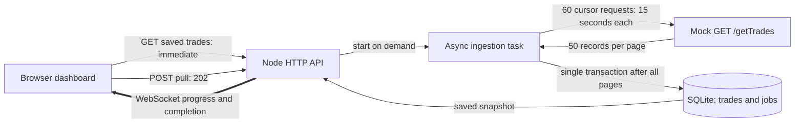

# Architecture and constraints

## Why this design

The 30-second limit affects both browser-to-application and application-to-exchange HTTP. A background worker alone does not fix the latter. This implementation therefore defines a **paginated mock exchange contract**: 3,000 records, 50 per page, 60 pages. Default latency is 900,000 / 60 = 15,000 ms per request. The backend enforces an absolute 30-second response lifetime and the worker has a 25-second per-request deadline. No HTTP request lasts for the whole pull.

`POST /api/pulls` creates a persisted running job and immediately returns 202. Event-loop asynchronous I/O drives the task; it does not block cache reads or need a scheduler. Pages are staged in bounded memory (3,000 records in this mock). A transaction inserts records and marks the job complete together. Only then is the new snapshot broadcast, preventing partial batches from appearing as completed pulls. Primary-key constraints prevent duplicate trade IDs.

The UI reads the local database once at startup. An upgraded WebSocket then pushes progress and completion. On every connection, subscription and initial snapshot occur synchronously, so a completion cannot fall between reading the snapshot and subscribing. The UI ignores an older initial HTTP response once it has received a socket snapshot. Reconnection always gets the current snapshot, recovering events missed while disconnected. No interval calls a status or trade endpoint.

## Honest limits and failure behavior

- WebSocket support is a prerequisite. WebSockets begin with an HTTP upgrade but require the gateway to allow the upgraded connection beyond its HTTP timeout. SSE heartbeats do **not** bypass an absolute 30-second HTTP lifetime, so SSE is not used here.
- If the real exchange only offers a monolithic 15-minute response, it needs a cursor/export-job/callback interface, an ingestion component outside the restricted network, or a network-policy change. This mock’s pagination must not be presented as an existing BSE capability.
- Any page error or timeout fails the job without publishing a partial batch. Existing data remains readable. There is no automatic retry storm; a user may start a new pull.
- On process restart, unfinished jobs are marked failed; completed trades persist. This demonstration does not promise durable job continuation. Graceful shutdown cancels an in-flight request.
- A single-process guard rejects simultaneous pulls. Horizontal scaling needs a shared lock/queue and pub/sub. SQLite and full snapshots suit this assessment, not an unbounded production ledger.
- The two logical services share one process for a one-command demo, but the worker actually calls `/getTrades` over HTTP. They can be deployed separately once an authenticated exchange URL is configured.
